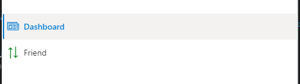

# Getting Started with Create React App

## Thực hiện

- Tạo dự án react thuần

```dos
    npm create-react-app myfluent
```

- Bổ sung các gói [FluentUI](https://developer.microsoft.com/en-us/fluentui)

```dos
yarn add @fluentui/react
yarn add @uifabric/react-cards
```

- Tạo menu phải Navigation. [Tài liệu hướng dẫn FluentUI](https://developer.microsoft.com/en-us/fluentui#/controls/web/nav)



- Bổ sung typescript [xem](https://create-react-app.dev/docs/adding-typescript/)

```dos
yarn add --save typescript @types/node @types/react @types/react-dom @types/jest
```

*Ghi chú*: có thể phải --force thì mới cài được typescript

- Tạo file *tsconfig.json bằng lệnh

```dos
    npx -p typescript tsc --init
```
  
  và đổi nội dung như sau **"target": "es6"**

- Đổi các file **.js** thành **.tsx** là xong. Bắt đầu chạy Typescript. <br/>
  Navigation được cấu trúc rõ ràng, định kiểu chặt chẽ hơn với Typescript
