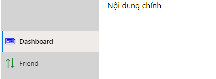
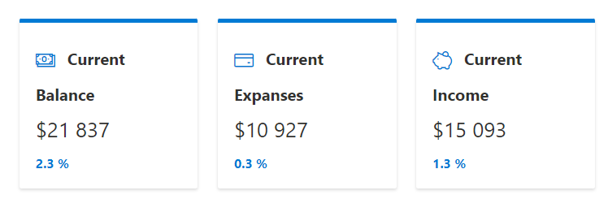
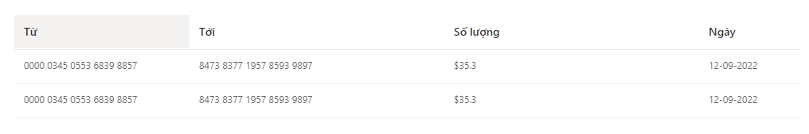

# Getting Started with Create React App

## Nguồn tham khảo

- URL: https://www.blog.duomly.com/how-to-use-fluent-ui-building-a-fintech-dashboard-tutorial/
- Video: https://www.youtube.com/watch?v=P9s6dsdu_9c
- Cảm ơn tác giả Anna Danilec / Many thank to [Anna Danilec](https://www.blog.duomly.com/authors/anna-danilec)

## Thực hiện

- Tạo dự án react thuần

```dos
    npm create-react-app myfluent
```

- Bổ sung các gói [FluentUI](https://developer.microsoft.com/en-us/fluentui)

```dos
yarn add @fluentui/react
yarn add @uifabric/react-cards
```

- Tạo menu phải Navigation. [Tài liệu hướng dẫn FluentUI](https://developer.microsoft.com/en-us/fluentui#/controls/web/nav)


- Bổ sung typescript [xem](https://create-react-app.dev/docs/adding-typescript/)

```dos
yarn add --save typescript @types/node @types/react @types/react-dom @types/jest
```

*Ghi chú*: có thể phải --force thì mới cài được typescript

- Tạo file *tsconfig.json* bằng lệnh

```dos
    npx -p typescript tsc --init
```
  
  và đổi nội dung như sau **"target": "es6"**

- Đổi các file **.js** thành **.tsx** là xong. Bắt đầu chạy Typescript. <br/>
  Navigation được cấu trúc rõ ràng, định kiểu chặt chẽ hơn với Typescript

- Bổ sung Layout ms-Grid với [Fabric-Core](https://developer.microsoft.com/en-us/fluentui#/get-started/web#fabric-core) bằng cách  (Một cách khác là sử dụng component [Stack](https://developer.microsoft.com/en-us/fluentui#/controls/web/stack)

  
  - Cách 1:
    - cài đặt và triệu gọi css qua package.

    ```typescript
        npm install office-ui-fabric-react
        import 'office-ui-fabric-react/dist/css/fabric.css'
    ```

    Lưu ý: trong cửa sổ lập trình, mặc dù không reference tới file css này được, nhưng code vẫn chạy thành công

  - Cách 2: hoặc bổ sung css trực tiếp vào html. 

  ```html
  <link rel="stylesheet" href="https://static2.sharepointonline.com/files/fabric/office-ui-fabric-core/11.0.0/css/fabric.min.css"/>
  ```

  - Tiếp theo việc viết code thì giống nhau. [Xem hướng dẫn](https://developer.microsoft.com/en-us/fluentui#/styles/web/layout)

  ```typescript
     return (
        <>
          <div className="ms-Grid" dir="ltr">
            <div className={"ms-Grid-row"}>
              <div className={"ms-Grid-col ms-sm1 ms-md2 ms-lg2"}>Vị trí bên trái</div>
              <div className={"ms-Grid-col ms-sm6 ms-md8 ms-lg10"}>Nội dung chính</div>
            </div>
          </div>
        </>
      );
  ```
 
 - Tạo các card ở nội dung chính. <br/>
    <br/>
   *Lưu ý: Đối tượng Card không hỗ trợ với Typescript, nên code phải để ở dạng javascript.*

- Tạo bảng hiển thị dữ liệu. <br/>
    <br/>
pasteimage/2022-09-29-21-19-23.png